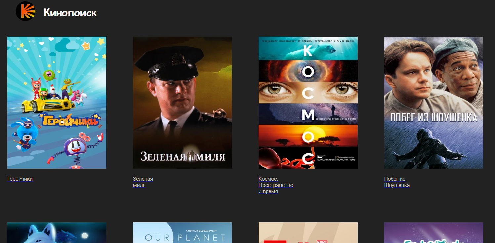
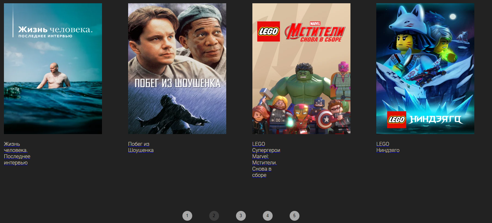
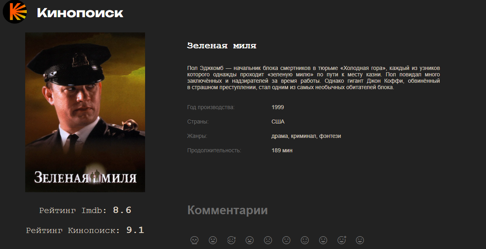
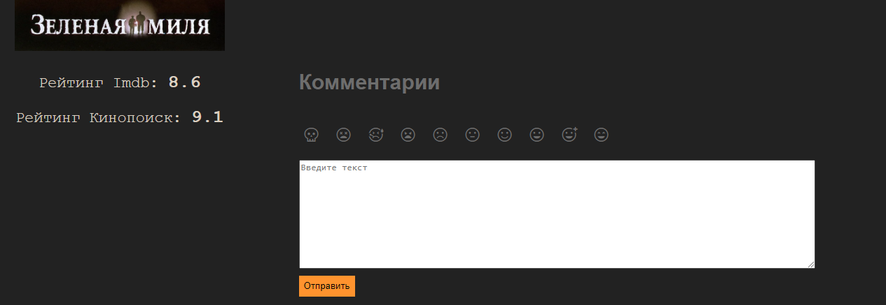

# kinopoisk
Это один из первых проектов, которые я сделала, обучаясь в рамках 2 курса IT-академии Евраза. Веб-приложение без серверной части, написанное на html и JavaScript

*Примечание: база данных с фильмами и информацией о них взята из открытых источников (kinopoisk fake api)

Главная страница приложения.

Возможен переход по страницам, фильмы в апи были отобраны по 20, с помощью query-параметров ссылка меняется и осуществляется переход.

При клике на фильм происходит переадресация на него, отображается подробная информация о нем. 

Добавлена форма написания отзыва о фильме, сверху иконки 10-балльной шкалы, снизу - форма для отзыва. 
